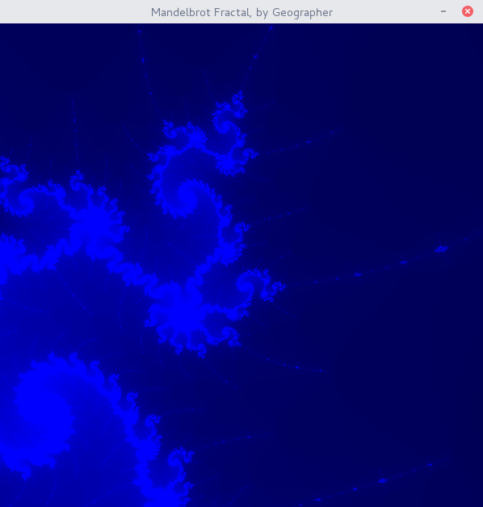

# mandelbrot-c-sdl2

Using the C language and the SDL2 library to draw the Mandelbrot set.

## Features

* Use the **arrow keys** to move
* Use the **+ key** to zoom in
* Use the **- key** to zoom out

## Requirements

* C standard library with (G)CC
* SDL2 library
* Possibly MinGW if running Windows

## Compilation

```
$ make help
Juste use make (without any argument) to compile.
Use make clean in order to delete mandelbrot.
If you have errors during compilation, you can contact me for help.
Windows users, you can use MinGW with this project.
```

Then run the program and enjoy ! :-)



Happy fractal !
